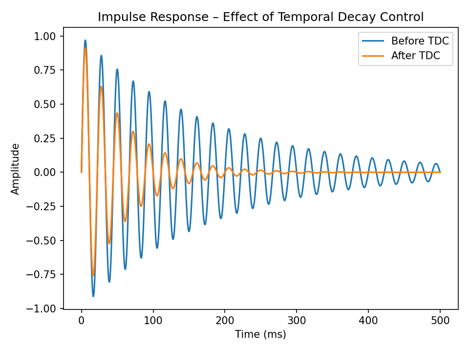

# CamillaFIR by Vilho Valittu

## v2.8.1

### A-FDW & TDC guidance improvements

- **Refined A-FDW bandwidth limits**
  - Fixed incorrect A-FDW bandwidth constraints that could produce overly wide or misleading smoothing regions.
  - Ensures A-FDW operates strictly within intended psychoacoustic and confidence-based limits.

- **Clearer A-FDW & TDC visualization**
  - Updated plot annotations and guides to better reflect the *effective* A-FDW bandwidth actually used.
  - Reduces confusion between configured values and internally clamped / safety-limited behavior.

- **Improved documentation & UI hints**
  - A-FDW and TDC descriptions updated to better explain *why* certain regions are protected or limited.
  - Helps advanced users interpret confidence masks, decay control, and correction safety logic.

### Notes
- DSP behavior is unchanged except for corrected A-FDW limit handling.
- No changes to FIR magnitude targets, phase algorithms, or auto-leveling logic.


**Time-domain–first FIR room correction (CamillaDSP-focused)**

CamillaFIR generates high-resolution **FIR correction filters** from REW exports (magnitude + phase).
Instead of treating everything as “EQ”, it separates three physical phenomena and corrects each with the right DSP method:

- **Propagation delay (Time-of-Flight / TOF):** removed explicitly before phase analysis
- **Excess phase distortion:** corrected with FIR phase reconstruction (Linear / Minimum / Mixed / Asymmetric)
- **Room-induced energy storage (room modes):** reduced with **Temporal Decay Control (TDC)** (time-domain, not amplitude EQ)


---

## Acknowledgements

Development inspired by the methodologies of **OCA** (Obsessive Compulsive Audiophile): [https://www.youtube.com/@ocaudiophile](https://www.youtube.com/@ocaudiophile)

---

**[Download Standalone EXE](https://drive.google.com/drive/folders/1AkESLDo-UhPqxDCdaZuXE6u8-H4EDuOI)**

---


## What you get

- FIR filters exported as **WAV (32-bit float)** or text
- Optional **CamillaDSP YAML** snippet
- Plots and a **Summary.txt** report (confidence, RT60, match score, effective A-FDW bandwidth, safety limits)
- Multi-rate export for common sample rates (44.1/48/88.2/96/176.4/192 kHz)

---

## Quickstart (source)

```bash
git clone https://github.com/VilhoValittu/CamillaFIR.git
cd CamillaFIR
python -m venv venv
# Windows:
#   .\venv\Scripts\activate
# Linux/macOS:
#   source venv/bin/activate
pip install -r requirements.txt

#Linux
sudo apt update
sudo apt install -y chromium-browser

python camillafir.py
```

The UI opens in your browser (default: `http://localhost:8080`).

## System dependencies (PNG export)

Plotly PNG export uses Kaleido, which requires a Chromium-based browser
installed on the machine where CamillaFIR runs.

Ubuntu:
    sudo apt install chromium-browser


---

## Key features (v2.8.1)

- **2058-safe phase mode**  
  Disables room phase correction (confidence / FDW / excess-phase) and uses only theoretical XO phase and minimum-phase where applicable. Recommended when phase or group delay looks unstable or “spiky”.

- **Independent slope limits for boost vs cut (dB/oct)**  
  Separate slope constraints for boosts and cuts prevent gentle boosts from being flattened while still keeping aggressive cuts under control.

- **Temporal Decay Control (TDC) with safety brakes**  
  Time-domain reduction of room-induced energy storage with:
  - hard cap on total reduction per frequency bin  
  - optional slope limit (dB/oct) for predictable and stable decay shaping

- **Adaptive FDW (A-FDW)**  
  Frequency-dependent smoothing driven by measurement confidence:
  - high confidence → sharper correction  
  - low confidence → heavier smoothing  
  Includes corrected bandwidth limits and clear visualization of the *effective* A-FDW range.

- **DF smoothing (experimental)**  
  Optional Gaussian smoothing with approximately constant bandwidth in Hz across different sample rates and tap lengths, keeping perceived detail comparable.

- **Comparison mode (locked analysis grid)**  
  Locks scoring and plots to a fixed reference (fs/taps) so A/B comparisons remain deterministic and meaningful.

- **Multi-rate auto-taps mapping**  
  Automatically scales FIR taps to keep filter **time length constant** across sample rates (44.1 kHz reference).

- **WAV/IR-aware analysis path**  
  When using IR-derived WAV inputs, phase and reliability heuristics are adapted to avoid false “unreliable” regions compared to REW TXT-based responses.


---

## Documentation

- 📘 User & technical manual → `docs/Official_Manual.md`
- 🧠 Why this works → `docs/Why_CamillaFIR_Works.md`
- 📐 Academic DSP rationale (math) → `docs/Academic_DSP_Explanation.md`
- 🔁 Stability & reproducibility → `docs/Stability_and_Reproducibility.md`
- ⚖️ Comparison vs conventional EQ → `docs/Comparison_vs_EQ.md`

---

## Screenshot


