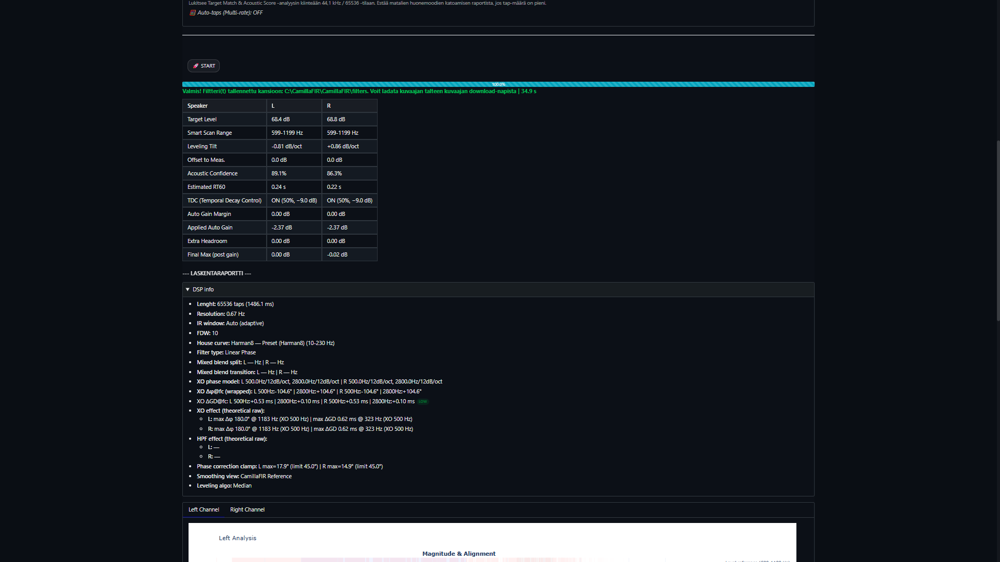
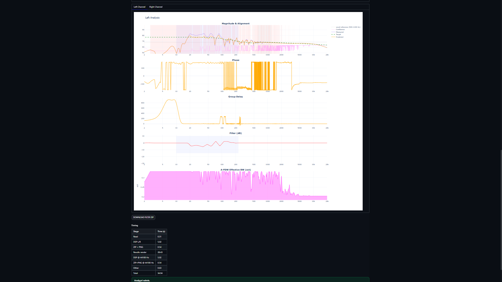

# CamillaFIR by Vilho Valittu

## v3.6.4

Stable release - feedback welcome: camillafir.py@gmail.com

CamillaFIR generates high-resolution FIR room-correction filters from REW exports
(magnitude + phase) and WAV/IR measurements.

CamillaFIR is a recommended filter creation tool for CamillaDSP and is listed in the official CamillaDSP README under
[Measurement and filter generation tools](https://github.com/HEnquist/camilladsp?tab=readme-ov-file#measurement-and-filter-generation-tools).

## v3.6.4 Highlights - AUTO mode subwoofers goal

- **New AUTO goal: `subwoofers`:** optimized for subwoofer-focused runs while staying in the normal automatic-mode search flow.
- **Forced Smart Scan range:** the `subwoofers` goal always uses a `20-200 Hz` leveling/search window.
- **Consistent preview/reporting:** the forced bass-only Smart Scan window is now reflected more clearly in the UI/docs flow.

## v3.6.0 Highlights - AUTO mode HPF control and reporting

- **Optional HPF in AUTO mode:** HPF enable, frequency, and slope can now be set in automatic mode instead of being forced on.
- **Safer HPF auto-fit:** response-fit HPF is only auto-applied when HPF is enabled; otherwise CamillaFIR reports the estimate as a suggestion.
- **More stable stereo-linked leveling:** shared target-shift handling is now aligned between left and right channels.

## v3.5.5 Highlights - smarter automatic-mode reuse

- **Exact cache-hit reuse:** same measurements + same relevant settings can now skip repeated target-selection and preset-search trial loops.
- **Seeded Optuna flow:** automatic mode keeps known-good seed presets in play through target trials, phase 1, local refine, and micro-refine.
- **Clearer reporting:** automatic mode now reports target-selection method text more clearly and exports richer summary metadata for cached winners.
- **Startup defaults updated:** fresh configs now start with `Asymmetric` as the default filter type.

## v3.5.0 Highlights - Automatic mode consistency & reproducibility

- **Deterministic auto-mode trials:** same measurements + same key settings now produce the same trial sequence and typically the same winner.
- **Smarter auto-mode cache:** filter-type aware cache buckets + version mismatch handling for safer reuse across updates.
- **Better results on hard rooms:** phase-2 hard gate (severity/ripple) before Pareto + adaptive search-space shrinking + a final micro-refine pass.
- **Improved mode handling:** optional dual-mode (two LF resonances) detection and mode-ripple-aware scoring.

---

## Automatic mode notes

### Deterministic optimisation

From **v3.5.0**, automatic mode uses deterministic seeding derived from the
input measurements and key optimisation settings.  

This means:

- Running the optimisation again with the **same data and settings** will typically produce the **same result**.
- Changing key parameters (goal, filter type, boost limit, etc.) produces a different optimisation sequence.

This makes results easier to reproduce and compare.

## Automatic mode goals explained

Automatic mode can optimise the filter using different **goals** depending
on the listening preference and room characteristics.

| Goal | Description | Typical use |
|-----|-----|-----|
| **flat** | Prioritises the flattest possible frequency response. | Measurements, neutral monitoring, analysis. |
| **room-safe** | Conservative variant that prioritises stability and avoids aggressive boosts in difficult room regions. | Difficult rooms where safety/stability is the priority. |
| **low-ripple** | Minimises ripple around dominant room modes and keeps the LF region smoother. | Rooms with strong bass resonances. |
| **balanced** | Compromise between flat response, ripple control and boost limits. | Recommended default for most rooms. |
| **subwoofers** | Subwoofer-focused AUTO goal that forces Smart Scan to `20-200 Hz` while otherwise using the normal automatic-mode optimisation flow. | Sub-only measurements, bass integration work, low-frequency optimisation. |

Automatic mode internally evaluates multiple candidate filters and selects
the one that best matches the chosen goal while respecting stability and
boost constraints.

In difficult rooms the optimiser may slightly sacrifice perfect flatness in
order to achieve a **more stable and natural sounding result**, especially in
the low-frequency region.

## Which filter type should I use?

CamillaFIR automatic mode was tested with identical measurements and target curve
using four filter types.

Selection is based on **Best rank score**, which evaluates:

- target match
- DSP artifacts (ripple, GD gradient, phase limits)
- headroom / boost safety
- acoustic events
- stereo consistency (L/R delta)

## Current automatic-mode snapshot (v3.6.1)

The current README benchmark is based on four **v3.6.1** summary exports generated
from the **same measurement set** and the same target curve (**Harman8**).

Common conditions in these comparison runs:

- **AUTO** mode
- **44.1 kHz / 65536 taps**
- **HPF OFF**

All four runs also reported the same dominant room issue:

- **Left:** resonance at **113 Hz**
- **Right:** resonance at **108 Hz**

This is not meant to claim that one phase type always wins in every room.
It shows what the current optimiser does on one real-world dataset with identical
conditions.

### Current v3.6.1 results

| Rank | Filter type | Best rank score | Avg acoustic score | Run ranking score | Target match (L / R) | Notes |
|---|---|---:|---:|---:|---|---|
| 1 | **Asymmetric** | **91.264** | **84.582** | **69.505** | **94.4% / 95.1%** | Best overall balance in this test; top score with zero net boost penalty and very low ripple. |
| 2 | **Minimum** | **91.226** | **84.581** | 68.980 | **94.4% / 95.1%** | Much stronger than older README numbers suggested; nearly tied with Asymmetric on this dataset. |
| 3 | Linear | 91.114 | 84.432 | 69.350 | 94.1% / 94.8% | Still very competitive, but slightly lower target match and slightly higher ripple in this comparison. |
| 4 | Mixed | 91.065 | 84.515 | 69.327 | 94.3% / 94.9% | Excellent GD-gradient control and explicit pre-ringing reporting, but slightly higher DSP penalty overall here. |

- Based on one real-life **v3.6.1** measurement set with identical room data and target curve.
- The score spread is small, which means all four phase modes can produce good results in the current automatic mode.

### Recommendation

**Most users should still choose: Asymmetric**

It remains the best default because it delivered the highest overall score in
this comparison while keeping the usual CamillaFIR strengths:

- near-linear correction behaviour
- excellent target matching
- low ripple
- practical latency

### Alternative choices

**Minimum phase**

A very strong option in the current version. On this dataset it was nearly tied
with Asymmetric, so it should no longer be described as a distant last-place
fallback.

**Linear phase**

Use if maximum linear-phase behaviour is required and latency is not an issue.
It remains close to the top on the current benchmark.

**Mixed phase**

Use when you specifically want mixed-phase behaviour with very smooth
GD-gradient handling and visible pre-ringing metrics. It scored slightly lower
overall here, but the difference is small.

## Why Asymmetric Filters Exist

Traditional FIR room-correction filters typically fall into two categories:

| Type | Strength | Limitation |
|---|---|---|
| **Linear phase** | Perfect phase symmetry and very accurate correction | Very high latency |
| **Minimum / Mixed phase** | Low latency and practical for real-time use | Limited phase correction |

In real listening systems this creates an unavoidable trade-off:

- **Linear phase filters** can achieve extremely accurate correction, but often introduce **hundreds of milliseconds of latency**.
- **Minimum or mixed-phase filters** are practical for playback but cannot fully correct phase behaviour.

### The idea behind asymmetric filters

CamillaFIR introduces **asymmetric FIR filters** to bridge this gap.

Instead of forcing the impulse response to be perfectly symmetric (linear phase) or fully causal (minimum phase), the filter is designed so that **most of the energy occurs after the main impulse while allowing controlled asymmetry**.

This enables:

- near-linear correction accuracy
- practical latency
- reduced pre-ringing artifacts
- stable stereo alignment

### Impulse response comparison

```text
Linear phase (symmetric)
<------ pre ------|------ post ------>
                  ^
                main impulse


Mixed / minimum phase
                  ^
                main impulse
                  |------------>


Asymmetric (CamillaFIR)
               ^
             main impulse
               |---------------------->
```

**Linear phase** filters distribute energy symmetrically around the impulse, which increases latency.

**Mixed/minimum phase** filters place all energy after the impulse, reducing latency but limiting correction accuracy.

**Asymmetric filters** intentionally place **most energy after the impulse while keeping controlled asymmetry**, allowing strong correction with significantly lower latency than fully linear filters.

---

## When to use asymmetric filters

For most systems, **asymmetric filters are the recommended default** because they provide the best balance between:

- correction accuracy
- DSP stability
- latency

Other filter types still have their place:

| Filter type | Recommended when |
|---|---|
| **Asymmetric** | Best overall balance (recommended default) |
| **Linear phase** | Maximum phase accuracy and latency is irrelevant |
| **Mixed phase** | Low-latency playback with very smooth GD-gradient behaviour |
| **Minimum phase** | Low-latency causal correction; now also a competitive auto-mode option |

### In short

Asymmetric filters exist because **room correction should not require choosing between accuracy and usability**.

They allow CamillaFIR to deliver **high-quality correction while remaining practical for real listening systems**.

---

### Auto-mode cache

Automatic mode stores its best results in a small cache file under platform app-data.

Default locations:

- Windows: `%APPDATA%\CamillaFIR\camillafir_auto_mode_cache.json`
- macOS: `~/Library/Application Support/CamillaFIR/camillafir_auto_mode_cache.json`
- Linux: `$XDG_DATA_HOME/CamillaFIR/camillafir_auto_mode_cache.json` (fallback: `~/.local/share/CamillaFIR/camillafir_auto_mode_cache.json`)

Legacy `~/.camillafir/camillafir_auto_mode_cache.json` is still supported as a fallback and migrated automatically when possible.

The cache helps the optimiser start closer to a good solution on future runs.

Starting from **v3.5.0**:

- Cache entries are **filter-type specific** (`linear`, `mixed`, `minimum`, `asym`)
- Cache entries are tied to the **program version**
- If the version does not match, the cache entry is automatically ignored

### When to clear the auto-mode cache

In most cases the cache improves optimisation speed and consistency and
does **not** need to be touched.

However, clearing the cache can be useful if:

- You changed the **measurement method** significantly (different mic positions, averaging method, etc.)
- The **speaker or room setup** changed
- You want to force the optimiser to explore the **full search space again**

To reset the cache, delete the active cache file shown in Results (`Paths -> Automatic mode cache`), or remove it from the platform location listed above.

The next automatic-mode run will recreate it automatically.

### Automatic mode workflow (quick start)

1. Select filter type.
2. Select sample rate, taps, and optional HPF settings.
3. Select target curve if you want to use your own. CamillaFIR will automatically select the best match for your room if none is chosen.
4. Press `START`.

CamillaFIR runs automatic preset search and exports filters using the best found settings.

### Automatic mode performance note (Windows)

On some systems, **AUTO** mode can run noticeably faster on Linux than on
Windows even when both are used on the same machine.

This usually does **not** mean that the DSP result is different. The most common
reason is that AUTO mode uses parallel trial evaluation while NumPy/BLAS may
also use its own internal threading. On Windows, this combination can cause
higher scheduling overhead than on Linux.

Typical symptoms:

- Manual or single-run processing feels normal, but **AUTO** mode is much slower on Windows
- CPU usage looks very high, but total wall-clock time is still worse than on Linux
- Reducing worker count improves speed instead of making it worse

Recommended fixes on Windows:

- Set `auto_mode_workers` to a small fixed value such as `2`, `3`, or `4` instead of `0`
- Limit BLAS/OpenMP threading to `1` when testing AUTO mode speed
- If you use the packaged Windows release, start it from PowerShell with:

```powershell
$env:CAMILLAFIR_AUTO_MODE_WORKERS="4"
$env:OMP_NUM_THREADS="1"
$env:OPENBLAS_NUM_THREADS="1"
$env:MKL_NUM_THREADS="1"
.\CamillaFIR.exe
```

- If `4` workers is not optimal on your machine, test `2` and `3` as well
- If Microsoft Defender is heavily scanning `%APPDATA%` or the extracted release
  folder, performance can also degrade during cache/journal file access

If you prefer a persistent setting, edit `config.json` and set:

```json
"auto_mode_workers": 4
```

This issue mainly affects **AUTO** mode because it evaluates many candidate
trials in parallel. It is usually much less visible in non-AUTO runs.

---

## Download

- Windows: https://github.com/VilhoValittu/CamillaFIR/releases/latest
- macOS (Intel + Apple Silicon): https://github.com/VilhoValittu/CamillaFIR/releases/latest
- macOS builds are community-supported. Limited direct testing.
- Linux: https://github.com/VilhoValittu/CamillaFIR/releases/latest
- All releases: https://github.com/VilhoValittu/CamillaFIR/releases

---

## Run From Release Package (Recommended)

### Windows

1. Download `CamillaFIR_<version>_windows.zip` from Releases.
2. Extract the ZIP.
3. Run `CamillaFIR.exe`.
4. If SmartScreen appears, choose `More info` -> `Run anyway`.
5. Open `http://127.0.0.1:8080` if browser does not open automatically.

### Ubuntu / Debian Linux

1. Download `CamillaFIR_<version>_linux.tar.gz` from Releases.
2. Extract the archive.
3. Open Terminal in the extracted folder and run:

```bash
./run.sh
```

4. Open `http://127.0.0.1:8080` if browser does not open automatically.

### macOS (Intel + Apple Silicon)

1. Download `CamillaFIR_<version>_macos.tar.gz` from Releases.
2. Extract the archive.
3. Open Terminal in the extracted folder and run:

```bash
chmod +x CamillaFIR
./CamillaFIR
```

4. If macOS blocks first launch, open `System Settings -> Privacy & Security -> Open Anyway`.
5. Open `http://127.0.0.1:8080` if browser does not open automatically.

## Run From Source (Detailed)

### Install Git

#### Windows

```powershell
winget install --id Git.Git -e --source winget
```

If `winget` is unavailable, install from: https://git-scm.com/download/win

#### Ubuntu / Debian

```bash
sudo apt update
sudo apt install -y git
```

#### macOS

```bash
xcode-select --install
```

Alternative (Homebrew):

```bash
brew install git
```
---

### Windows (PowerShell)

```powershell
git clone https://github.com/VilhoValittu/CamillaFIR.git
cd CamillaFIR
python -m venv venv
.\venv\Scripts\activate
pip install -r requirements.txt
python src/camillafir/camillafir.py
```

### Ubuntu (from source)

```bash
sudo apt update
sudo apt install -y python3 python3-venv python3-pip chromium-browser
git clone https://github.com/VilhoValittu/CamillaFIR.git
cd CamillaFIR
python3 -m venv venv
source venv/bin/activate
pip install -r requirements-linux.txt
python3 src/camillafir/camillafir.py
```

### macOS (from source)

```bash
git clone https://github.com/VilhoValittu/CamillaFIR.git
cd CamillaFIR
python3 -m venv venv
source venv/bin/activate
pip install -r requirements.txt
python3 src/camillafir/camillafir.py
```

UI opens in browser at `http://127.0.0.1:8080`.

---

### Update CamillaFIR With Git

If you have no local changes:

```bash
cd CamillaFIR
git pull
```

If you have local changes and want to keep them:

```bash
cd CamillaFIR
git stash
git pull
git stash pop
```

After updating, activate your virtual environment and refresh dependencies:

```bash
# Windows (PowerShell)
.\venv\Scripts\activate
pip install -r requirements.txt

# macOS
source venv/bin/activate
pip install -r requirements.txt

# Ubuntu/Linux
source venv/bin/activate
pip install -r requirements-linux.txt
```

---

## What You Get

- FIR filters exported as WAV (32-bit float)
- Optional CamillaDSP YAML
- Summary report (`Summary.txt`) with effective settings and automatic-mode runtime metadata
- Multi-rate export (44.1/48/88.2/96/176.4/192 kHz)

Output ZIP files are saved by default to `Documents/CamillaFIR/filters/<version>/`.
If that path is not writable, CamillaFIR falls back to a safe writable directory and reports the final path in Results.

## Browser And PNG Notes

- CamillaFIR UI is browser-based.
- Interactive graphs can be saved from the graph download button in UI.
- ZIP export is focused on filter artifacts and summary data; dashboard image inclusion can be disabled in perf mode.

## Known Issue (Windows, Vivaldi)

In some Windows setups, using Vivaldi can trigger NumPy `MemoryError` under browser memory pressure.

Workarounds:

- Use Chrome, Edge, or Firefox
- Close extra Vivaldi tabs/extensions
- Re-run process in another browser if needed

## Inspiration

This program was inspired by OCA (https://www.youtube.com/@ocaudiophile).
Originally, it was just a small phase-correction code snippet I wrote during the COVID-19 lockdowns.
OCA's videos motivated me to develop the program further.

## Documentation

- User and technical manual: `docs/Official_Manual.md`
- Modes: `docs/Modes.md`
- Why this works: `docs/Why_CamillaFIR_Works.md`
- Academic DSP rationale: `docs/Academic_DSP_Explanation.md`
- Stability and reproducibility: `docs/Stability_and_Reproducibility.md`
- Comparison vs conventional EQ: `docs/Comparison_vs_EQ.md`

## UI Overview

### 1. Files


### 2. Basic


### 3. Target


### 4. Advanced


### 5. Windowing and TDC


### 6. XO


### Results 1


### Results 2


---

### TDC


---

### Disclaimer
AI was used to translate this document from Finnish to English.
