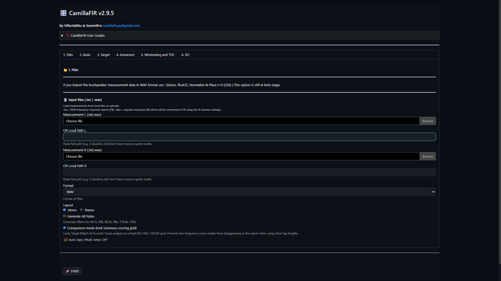
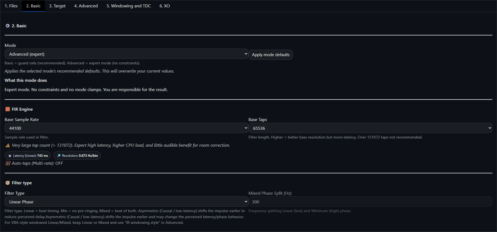
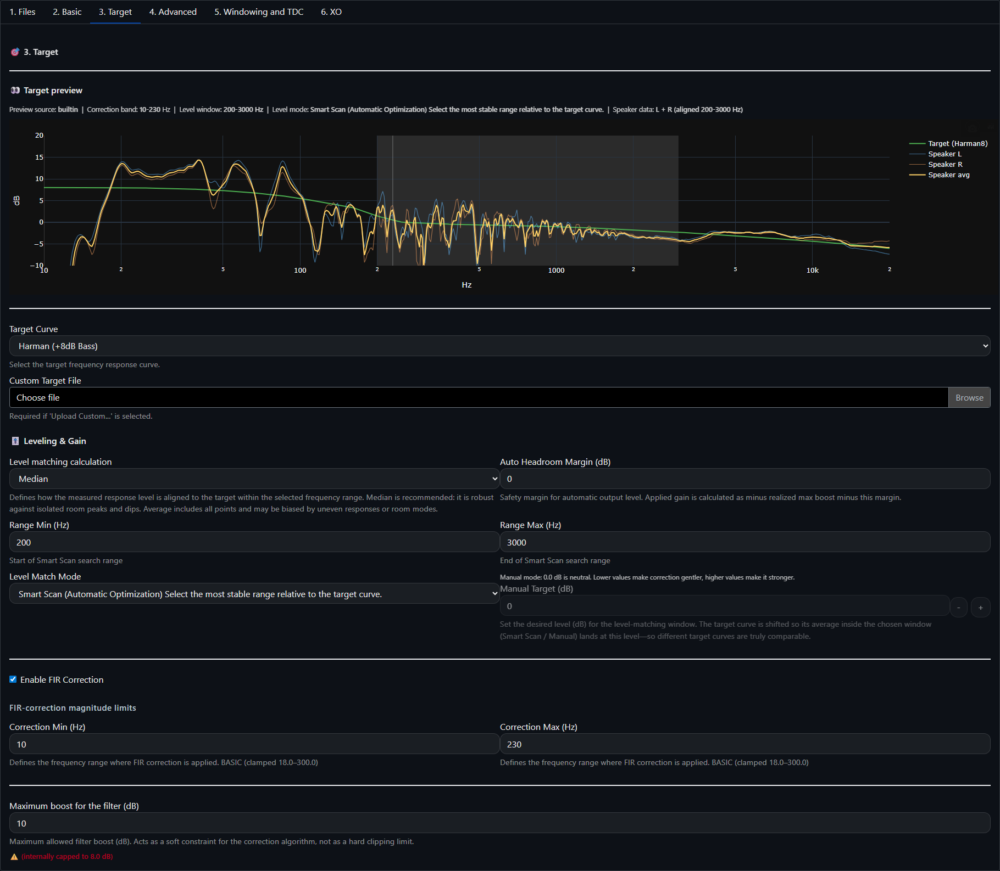
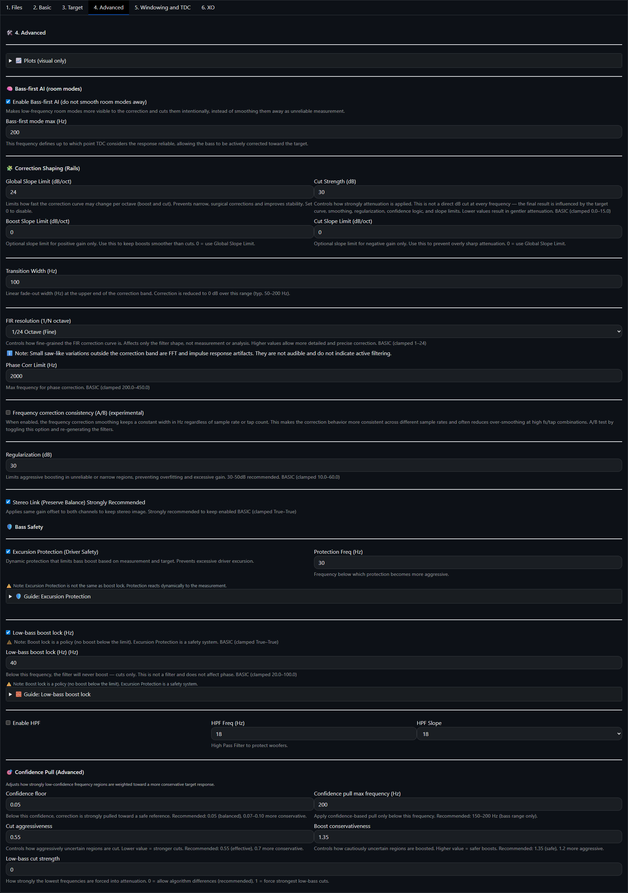
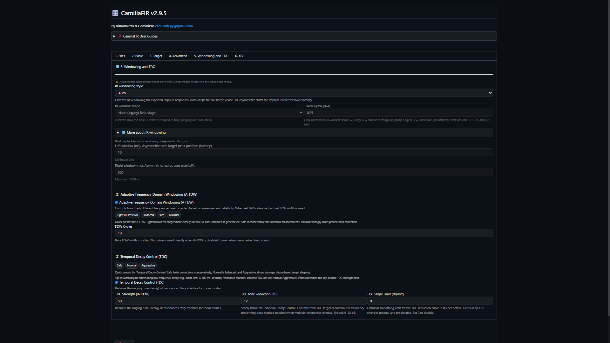
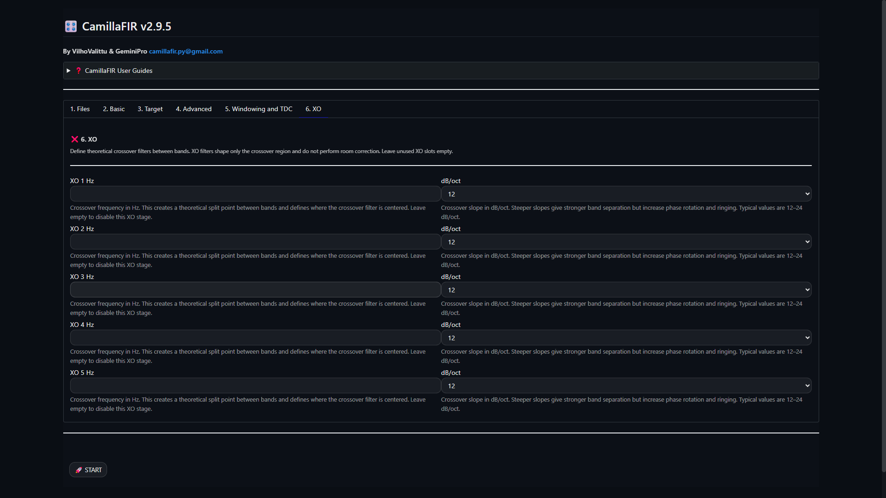
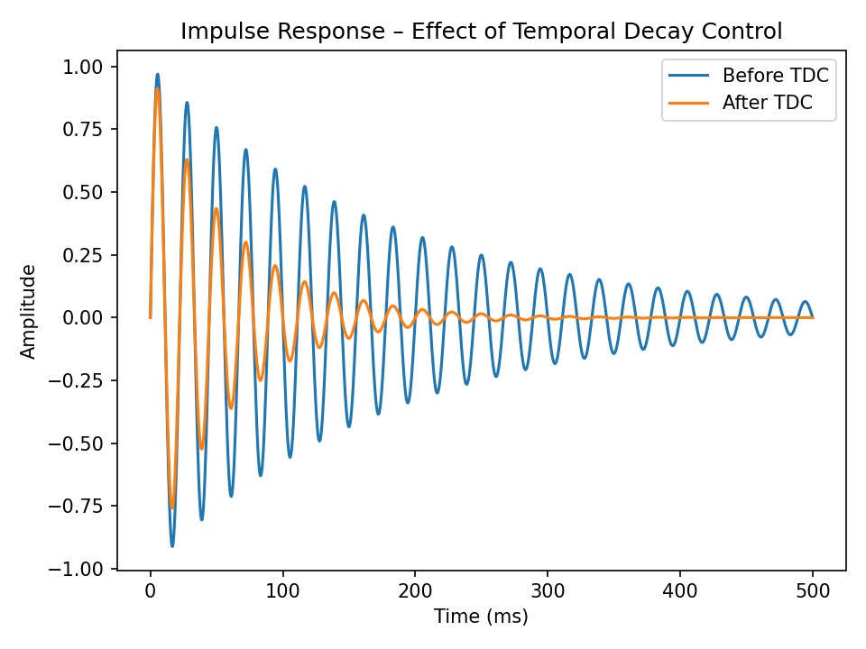

# CamillaFIR by Vilho Valittu

## v3.2.0
Stable release - feedback welcome: camillafir.py@gmail.com

CamillaFIR generates high-resolution FIR room-correction filters from REW exports
(magnitude + phase) and WAV/IR measurements.

## Inspiration

This program was inspired by OCA (https://www.youtube.com/@ocaudiophile).
Originally, it was just a small phase-correction code snippet I wrote during the COVID-19 lockdowns.
OCA's videos motivated me to develop the program further.

## v3.2.0 Highlights

- WAV input parsing is aligned to a deterministic TXT-baseline policy for more consistent WAV vs TXT behavior.
- Added WAV-only ripple cleanup near the correction upper edge and final FIR post-polish.
- Added stricter System Health checks for missing/incomplete L/R measurement sources.
- Added run timing visibility in UI (read, DSP, ZIP/PNG, render, total).
- Summary export now includes program version (`Version: v.3.2.0`).

## Download

- Windows: https://github.com/VilhoValittu/CamillaFIR/releases/latest
- macOS (Intel + Apple Silicon): https://github.com/VilhoValittu/CamillaFIR/releases/latest
- macOS builds are community-supported. Limited direct testing.
- Linux: https://github.com/VilhoValittu/CamillaFIR/releases/latest
- All releases: https://github.com/VilhoValittu/CamillaFIR/releases

## Run From Release Package (Recommended)

### Windows

1. Download `CamillaFIR_<version>_windows.zip` from Releases.
2. Extract the ZIP.
3. Run `CamillaFIR.exe`.
4. If SmartScreen appears, choose `More info` -> `Run anyway`.
5. Open `http://127.0.0.1:8080` if browser does not open automatically.

### Ubuntu / Debian Linux

1. Download `CamillaFIR_<version>_linux.tar.gz` from Releases.
2. Extract the archive.
3. Open Terminal in the extracted folder and run:

```bash
./run.sh
```

4. Open `http://127.0.0.1:8080` if browser does not open automatically.

### macOS (Intel + Apple Silicon)

1. Download `CamillaFIR_<version>_macos.tar.gz` from Releases.
2. Extract the archive.
3. Open Terminal in the extracted folder and run:

```bash
chmod +x CamillaFIR
./CamillaFIR
```

4. If macOS blocks first launch, open `System Settings -> Privacy & Security -> Open Anyway`.
5. Open `http://127.0.0.1:8080` if browser does not open automatically.

## Run From Source (Detailed)

### Install Git

#### Windows

```powershell
winget install --id Git.Git -e --source winget
```

If `winget` is unavailable, install from: https://git-scm.com/download/win

#### Ubuntu / Debian

```bash
sudo apt update
sudo apt install -y git
```

#### macOS

```bash
xcode-select --install
```

Alternative (Homebrew):

```bash
brew install git
```

### Update CamillaFIR With Git

If you have no local changes:

```bash
cd CamillaFIR
git pull
```

If you have local changes and want to keep them:

```bash
cd CamillaFIR
git stash
git pull
git stash pop
```

After updating, activate your virtual environment and refresh dependencies:

```bash
# Windows (PowerShell)
.\venv\Scripts\activate
pip install -r requirements.txt

# Ubuntu/macOS
source venv/bin/activate
pip install -r requirements.txt
```

For Ubuntu/Linux source installs, also run:

```bash
pip install -r requirements-linux.txt
```

### Windows (PowerShell)

```powershell
git clone https://github.com/VilhoValittu/CamillaFIR.git
cd CamillaFIR
python -m venv venv
.\venv\Scripts\activate
pip install -r requirements.txt
python src/camillafir/camillafir.py
```

### Ubuntu (from source)

```bash
sudo apt update
sudo apt install -y python3 python3-venv python3-pip chromium-browser
git clone https://github.com/VilhoValittu/CamillaFIR.git
cd CamillaFIR
python3 -m venv venv
source venv/bin/activate
pip install -r requirements-linux.txt
python3 src/camillafir/camillafir.py
```

### macOS (from source)

```bash
git clone https://github.com/VilhoValittu/CamillaFIR.git
cd CamillaFIR
python3 -m venv venv
source venv/bin/activate
pip install -r requirements.txt
python3 src/camillafir/camillafir.py
```

UI opens in browser at `http://127.0.0.1:8080`.

## What You Get

- FIR filters exported as WAV (32-bit float)
- Optional CamillaDSP YAML
- Summary report (`Summary.txt`)
- Multi-rate export (44.1/48/88.2/96/176.4/192 kHz)

Output ZIP files are saved to `filters/` in the project root.

## Browser And PNG Notes

- CamillaFIR UI is browser-based.
- Interactive graphs can be saved from the graph download button in UI.
- ZIP export is focused on filter artifacts and summary data; dashboard image inclusion can be disabled in perf mode.

## Known Issue (Windows, Vivaldi)

In some Windows setups, using Vivaldi can trigger NumPy `MemoryError` under browser memory pressure.

Workarounds:

- Use Chrome, Edge, or Firefox
- Close extra Vivaldi tabs/extensions
- Re-run process in another browser if needed

## Documentation

- User and technical manual: `docs/Official_Manual.md`
- Modes: `docs/Modes.md`
- Why this works: `docs/Why_CamillaFIR_Works.md`
- Academic DSP rationale: `docs/Academic_DSP_Explanation.md`
- Stability and reproducibility: `docs/Stability_and_Reproducibility.md`
- Comparison vs conventional EQ: `docs/Comparison_vs_EQ.md`

## UI Overview

### 1. Files


### 2. Basic


### 3. Target


### 4. Advanced


### 5. Windowing and TDC


### 6. XO


### TDC


### Disclaimer
AI was used to translate this document from Finnish to English.
